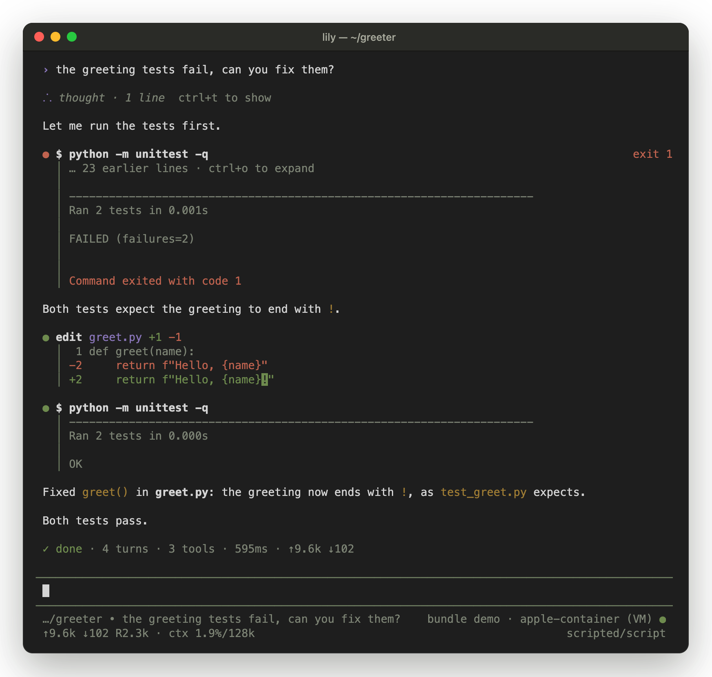

<p align="center">
  <a href="https://saito-karuha.github.io/Lily/"></a>
</p>

<p align="center">
  <a href="https://saito-karuha.github.io/Lily/"><b>Website</b></a> ·
  <a href="https://saito-karuha.github.io/Lily/docs/"><b>Docs</b></a> ·
  <a href="https://github.com/Saito-Karuha/Lily/releases"><b>Releases</b></a> ·
  <a href="CHANGELOG.md"><b>Changelog</b></a> ·
  <a href="GUIDE.zh-CN.md"><b>中文说明</b></a>
</p>

<p align="center">
  <a href="https://www.npmjs.com/package/lily-harness"></a>
  
  
  <a href="LICENSE"></a>
</p>

Lily is a coding agent for your terminal: open a project, type `lily`, and ask. Every tool call it makes runs in an isolated environment, which can be anything from a macOS sandbox to a microVM per session. Every run is also pinned and recorded exactly, so the agent you use every day doubles as a clean trajectory generator for research.

<p align="center">
  
</p>

## Install

```bash
npm install -g lily-harness
```

Lily needs Node.js 22.19 or newer on macOS or Linux. Then, in any project:

```bash
lily --script demo            # try it offline, no API key needed
export ANTHROPIC_API_KEY=…    # or OPENAI_API_KEY, GEMINI_API_KEY, OPENROUTER_API_KEY, DEEPSEEK_API_KEY, …
lily                          # pick a model on first run; it becomes your default
```

Self-hosted models (vLLM, SGLang or any other OpenAI-compatible server) take one entry in `~/.lily/config.json`, see [configuration](docs/configuration.md#self-hosted-models).

## What you get

- **An agent that feels familiar.** Streaming answers, tool cards with diffs, steering while it works, Esc to interrupt, sessions that survive restarts, compaction, a navigable conversation tree, fork and clone. The loop and tools come from the [Pi](https://github.com/earendil-works/pi) agent.
- **Isolation you choose.** Tools run through a small guest agent, never in your shell. You pick the environment: a macOS sandbox, Docker or Podman, gVisor, an Apple container VM, or a Firecracker microVM. Your API keys never enter it.
- **Runs you can reproduce.** The prompt, memory, skills and tool guidance that shape the agent live in immutable, content-addressed resource bundles, pinned before each run starts.
- **Records you can trust.** Every model call is captured at the provider boundary, including token ids when the model is served by vLLM. Every tool output is recorded before it is formatted. Any run can be exported as a trajectory.
- **Built to be driven.** There is a TypeScript SDK, `lily -p --json` event streams, a local HTTP API, and a router hook that lets many bundles coexist.

## Isolation backends

| backend | isolation | runs on |
|---|---|---|
| `seatbelt` | process sandbox | macOS (default) |
| `apple-container` | lightweight VM per environment | macOS 26+, Apple silicon |
| `docker` · `podman` | container | Linux; macOS through Docker Desktop and similar |
| `gvisor` | user-space kernel | Linux |
| `firecracker` | microVM | Linux with KVM |
| `local` | none | development only (Linux default) |

```bash
lily env backends                  # what this machine can run
lily --backend apple-container     # one session in its own VM
```

Platform support, setup and measured costs: [environments](docs/environments.md).

## Use it from code

```ts
import { LilyRuntime } from "lily-harness";

const runtime = await LilyRuntime.create();
const session = await runtime.createSession({
  mode: "batch",
  model: "anthropic/claude-sonnet-4-5",
  bundle: "base",
  environment: runtime.isolatedEnvironment({ kind: "directory", path: "./repo" }, "apple-container"),
});
const run = await session.prompt("The login test fails. Fix it.");
console.log((await run.done).status);
await runtime.close();
```

The [SDK guide](docs/sdk.md) covers the rest: routing between bundles, labels, annotations and trajectory export. The [HTTP API](docs/api.md) serves programs in other languages.

## Documentation

| | |
|---|---|
| [Getting started](docs/getting-started.md) | install, connect a model, first session |
| [Using the TUI](docs/tui.md) | commands, keys, branching |
| [Configuration](docs/configuration.md) | `config.json`, credentials, self-hosted models |
| [Environments](docs/environments.md) | isolation backends and platform compatibility |
| [SDK](docs/sdk.md) · [HTTP API](docs/api.md) | driving Lily from programs |
| [Bundles](docs/bundle-format.md) · [Trajectories](docs/trajectory-format.md) · [envd protocol](docs/envd-protocol.md) | formats and protocols |
| [Architecture](docs/architecture.md) · [Design decisions](docs/decisions.md) | how Lily is built, and why |

## Development

```bash
git clone https://github.com/Saito-Karuha/Lily.git && cd Lily
npm install
npm run build:envd     # cross-compiles the guest agent (needs Go 1.26+)
node bin/lily.mjs      # runs the TypeScript sources directly
npm test               # unit, integration and isolation tests
```

## License

[MIT](LICENSE). Lily builds on [Pi](https://github.com/earendil-works/pi) (MIT). Vendored third-party code keeps its own license notices.
